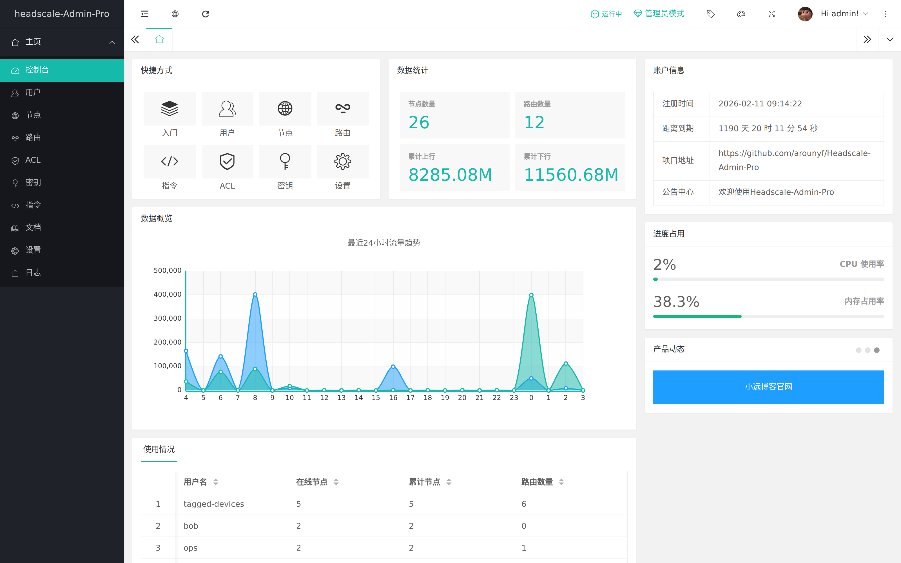
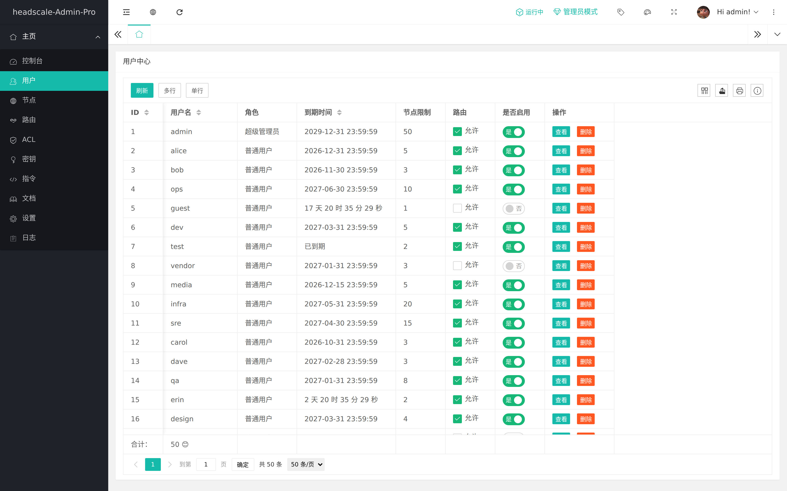
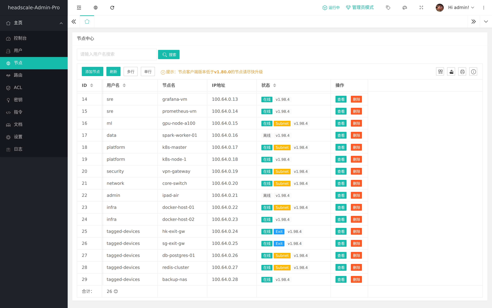
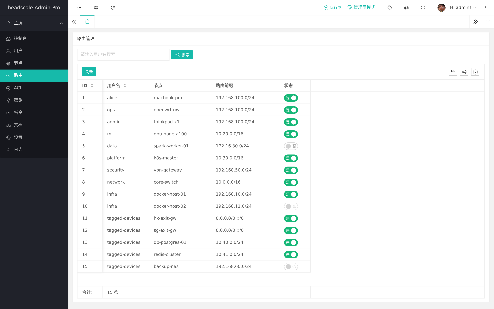
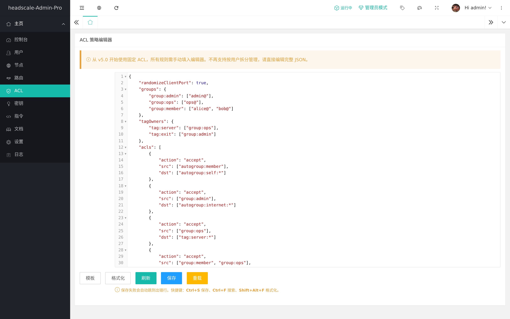
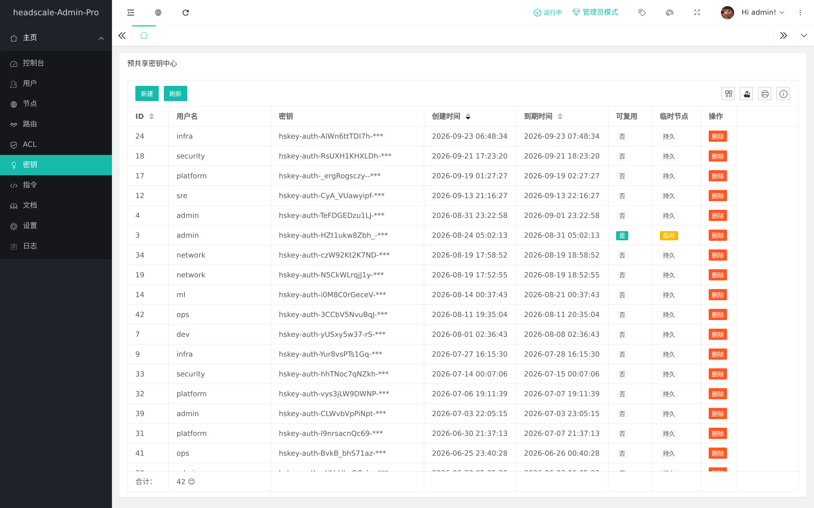
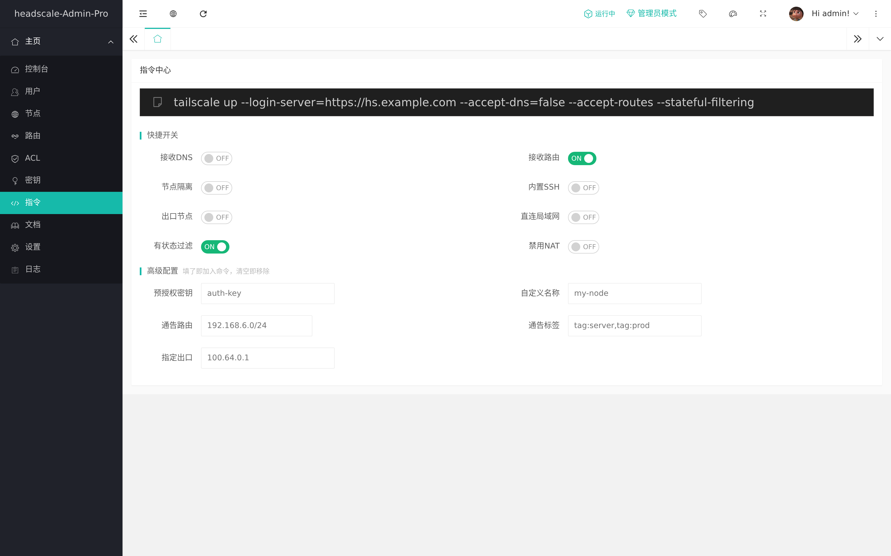
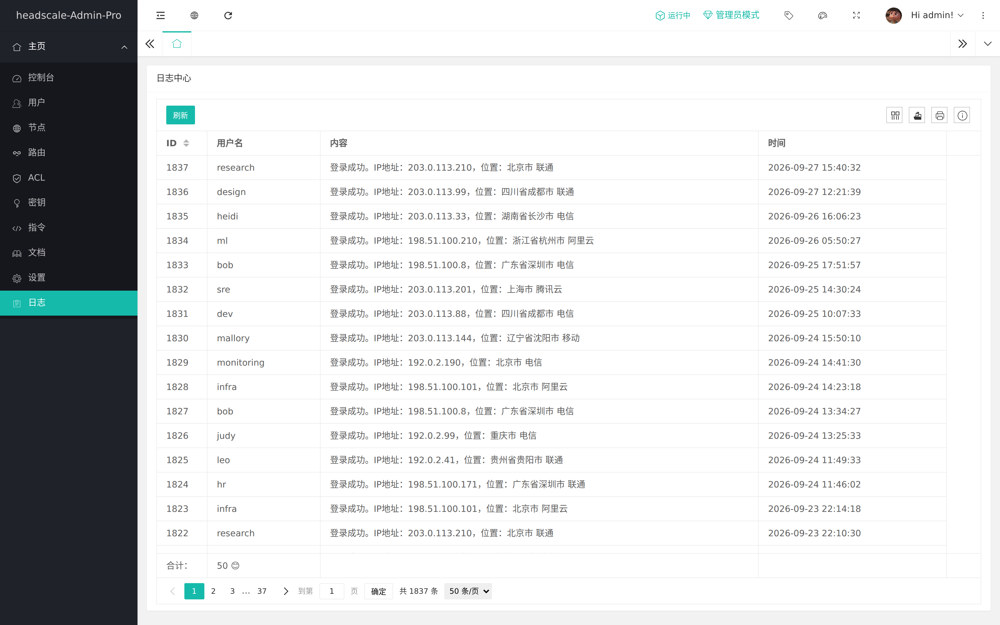
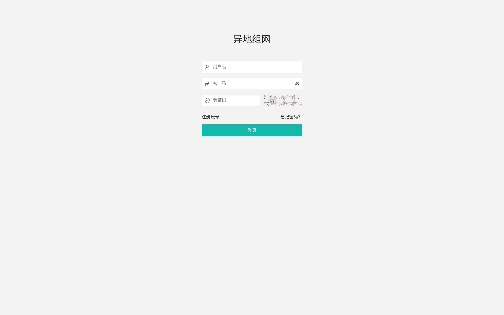
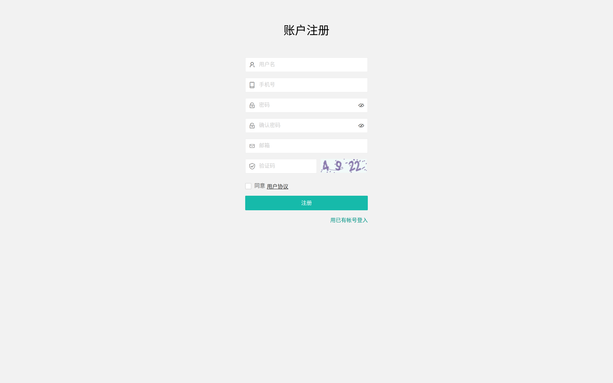

# 介绍
[](https://github.com/arounyf/headscale-Admin)
[](https://hub.docker.com/r/runyf/hs-admin)
[](https://hub.docker.com/r/runyf/hs-admin)
[](https://hub.docker.com/r/runyf/hs-admin/tags)

重点升级：   
1、基于本人发布的headscale-Admin使用python进行了后端重构   
2、容器内置headscale、实现快速搭建   
3、容器内置流量监测、无需额外安装插件   
4、基于headscale最新新版本进行开发和测试   

官方qq群： 892467054
# 时间线
2024年6月开始接触 headscale   
2024年9月8日 headscale-Admin 首个版本正式发布   
2025年3月26日 Headscale-Admin-Pro 基于python重构新版本正式发布  


# 使用docker部署
```shell
mkdir ~/hs-admin
cd ~/hs-admin
wget https://raw.githubusercontent.com/arounyf/Headscale-Admin-Pro/refs/heads/main/docker-compose.yml
docker-compose up -d
```

   
1、访问 http://ip:5000，注册admin账户即为系统管理员账户   

2、进入后台设置，修改你server url、网卡名等，修改之后点击保存，最后重启headscale

3、配置derp中转服务器（headscale配置文件路径 ~/hs-admin/config/config.yaml）

4、配置nginx，配置示例 nginx-example.conf(可选)


# 功能
- 用户管理
- 用户独立后台
- 用户到期管理
- 流量统计
- 基于用户ACL
- 节点管理
- 路由管理
- 日志管理
- 预认证密钥管理
- 角色管理
- api和menu权限管理
- 内置headscale
- 内置配置在线修改
- 一键添加节点(需配置反向代理)
- 自动更新apikey


# 版本关系
 注意 hs 代表非官方原版headscale，因数据库适配问题不得不对headscale代码进行修改。从v3.0开始支持从上一个版本升级，操作之前请一定要备份好你的数据
| Headscale-Admin-Pro | headscale |
| --- | --- |
| v3.x | v0.27.x-hs |
| v4.x | v0.28.x-hs |
| v5.x | v0.29.x-hs |

# 如何升级

> **升级前务必备份数据！** 请勿跨 headscale 版本升级，在 [Release](https://github.com/arounyf/Headscale-Admin-Pro/releases) 中可查看当前版本详细升级说明。


# 系统截图












